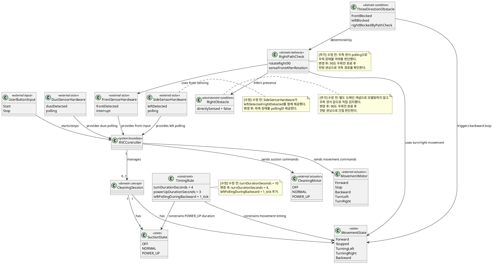

# RVC Domain Model

## 현재 단계

현재 단계는 Analysis (Revision)이다. 본 문서는 구현 클래스를 정의하지 않고, 변경된 요구사항에서 식별되는 도메인 개념과 관계를 표현한다. 본 문서는 기존 `docs/requirements/domain-model.md`를 Analysis 단계 산출물로 이동 및 수정한 결과이며, 기존 모델 대비 변경된 부분은 `[수정]`, `[추가]`, `[삭제]` 표식과 `(수정 전: ...)` 형식으로 보존한다.

시스템 바운더리는 legacy 프로젝트와 동일하게 `rvc-controller`이며, 실제 센서 하드웨어와 actuator는 `rvc-controller` 외부 actor로 둔다.

## 도메인 개념

| 개념 | 설명 | 관련 요구사항 |
|---|---|---|
| RVC Controller | 자동 진공 청소 제어 대상 시스템 | RVC-FR-001 ~ RVC-FR-037 |
| 사용자 버튼 입력 | 청소 시작 및 종료를 발생시키는 사용자 입력 | RVC-FR-001, RVC-FR-002 |
| 청소 세션 | 시작 버튼 입력 후 종료 버튼 입력 전까지의 자동 청소 수행 구간 | RVC-FR-001, RVC-FR-002 |
| 이동 상태 | 전진, 정지, 좌회전, 우회전, 후진과 같은 RVC의 이동 관련 상태 | RVC-FR-003, RVC-FR-008 ~ RVC-FR-016, RVC-FR-030 |
| 흡입 상태 | [수정] OFF, NORMAL, POWER_UP으로 구분되는 진공 흡입 상태. 직진 주행 중에만 NORMAL 또는 POWER_UP이 될 수 있다. (수정 전: OFF, NORMAL, POWER_UP으로 구분되는 진공 흡입 상태) | RVC-FR-017 ~ RVC-FR-029, RVC-FR-031, RVC-FR-038 |
| 전방 센서 하드웨어 | [수정] 전방 장애물 interrupt 및 우측 경로 확인 시 전방 장애물 값을 제공하는 외부 actor (수정 전: 전방 장애물 interrupt 입력을 제공하는 외부 actor) | RVC-FR-004, RVC-FR-006, RVC-FR-009, RVC-FR-036, RVC-FR-037 |
| 측면 센서 하드웨어 | [수정] legacy 외부 actor를 유지하되 좌측 장애물 polling 입력만 제공한다. (수정 전: 좌측 및 우측 장애물 polling 입력을 제공하는 외부 actor) | RVC-FR-005, RVC-FR-007, RVC-FR-012, RVC-FR-013 |
| 먼지 센서 하드웨어 | [수정] 먼지 감지 값을 1 tick마다 polling 방식으로 제공하는 외부 actor (수정 전: 먼지 감지 여부를 제공하는 외부 actor) | RVC-FR-024 ~ RVC-FR-029, RVC-FR-039 |
| Movement Motor | 이동 명령을 수신하는 외부 actuator | RVC-FR-030 |
| Cleaning Motor | 흡입 명령을 수신하는 외부 actuator | RVC-FR-031 |
| 우측 장애물 | [추가] 오른쪽에 존재하는 장애물이다. 직접적인 우측 센서 입력으로 감지하지 않는다. | RVC-FR-010, RVC-FR-035 |
| 우측 경로 확인 | [추가] 90도 우회전 완료 후 전방 센싱으로 기존 우측 방향의 장애물 존재 여부를 확인하는 도메인 행위 | RVC-FR-009, RVC-FR-013, RVC-FR-036, RVC-FR-037 |
| 삼방향 장애물 상황 | [수정] 전방, 좌측, 우측 장애물이 모두 존재하는 legacy 상황을 우측 경로 확인 결과로 대체 판단한 상황 (수정 전: 전방/좌측/우측 센서 값으로 직접 판단하는 상황) | RVC-FR-011, RVC-FR-037 |
| tick | [추가] RVC controller의 1회 주기 처리 단위 | RVC-CON-008, RVC-CON-009 |
| 회전 완료 시간 | [수정] 회전 모드 진입 후 4초 경과 시 회전 완료로 간주하기까지의 시간 (수정 전: 회전 모드 진입 후 10초 경과 시 회전 완료로 간주) | RVC-FR-015, RVC-CON-003 |
| POWER_UP 유지 시간 | 먼지 감지 후 POWER_UP을 유지하는 시간 | RVC-FR-026, RVC-CON-004 |

## 도메인 모델 다이어그램

## 도메인 규칙 요약

| 규칙 ID | 도메인 규칙 | 관련 요구사항 |
|---|---|---|
| DR-001 | 청소 세션은 사용자 시작 입력으로 생성되고 사용자 종료 입력으로 종료된다. | RVC-FR-001, RVC-FR-002 |
| DR-002 | 청소 세션 중 기본 이동 상태는 전진이다. | RVC-FR-003 |
| DR-003 | [수정] 전방 장애물이 없는 경우 좌측 장애물 입력은 회피 판단에 영향을 주지 않는다. (수정 전: 전방 장애물이 없는 경우 좌우 장애물 입력은 회피 판단에 영향을 주지 않는다.) | RVC-FR-005 |
| DR-004 | 좌회전은 기본 우선 회전 방향이다. | RVC-FR-008, RVC-FR-012 |
| DR-005 | [수정] 회전 상태는 4초 후 완료된 것으로 간주된다. (수정 전: 회전 상태는 10초 후 완료된 것으로 간주된다.) | RVC-FR-015, RVC-CON-003 |
| DR-006 | [수정] 정지, 회전, 후진 중 흡입 상태는 OFF이다. (수정 전: 정지, 회전, 후진 중 흡입 상태는 NORMAL이다.) | RVC-FR-017, RVC-CON-010 |
| DR-007 | 전진 중 먼지가 감지되면 흡입 상태는 POWER_UP이다. | RVC-FR-025 |
| DR-008 | POWER_UP은 3초 후 먼지 재확인 결과에 따라 유지되거나 NORMAL로 복귀한다. | RVC-FR-026 ~ RVC-FR-029 |
| DR-009 | 실제 센서 하드웨어와 actuator는 `rvc-controller` 바운더리 밖의 외부 actor이다. | RVC-NFR-001 |
| DR-010 | [추가] 직접적인 우측 센서 입력은 controller 판단 입력으로 사용하지 않는다. | RVC-FR-035 |
| DR-011 | [추가] 전방 및 좌측 장애물이 감지되면 90도 우회전 완료 후 전방 센싱으로 우측 경로를 확인한다. | RVC-FR-009 |
| DR-012 | [수정] 우측 경로 확인 결과가 막혀 있으면 삼방향 장애물 상황으로 판단하고 원래 방향 복귀 후 1 tick 후진한다. (수정 전: 전방/좌측/우측 센서가 모두 감지되면 후진한다.) | RVC-FR-011 |
| DR-013 | [수정] 3방향 장애물 처리 중 우측 경로 확인 전에 좌측 센서 polling을 1 tick마다 수행한다. (수정 전: 후진 중 좌우 센서를 polling하며 장애물이 해제된 방향으로 회전한다.) | RVC-FR-013, RVC-CON-009 |
| DR-014 | [추가] simulator의 우측 장애물 정보는 분석 모델의 controller 입력 actor로 추가하지 않으며, 검증 관찰 데이터로만 보존할 수 있다. | RVC-CON-007 |
| DR-015 | [추가] movement motor에 정지 명령을 제공할 때 cleaning motor에도 OFF 명령을 제공한다. | RVC-FR-038 |
| DR-016 | [추가] 직진 주행을 시작할 때 cleaning motor의 최소 상태는 NORMAL이다. | RVC-FR-024 |
| DR-017 | [수정] 먼지 센서 하드웨어는 먼지 감지 값을 1 tick마다 polling 방식으로 제공한다. (수정 전: 먼지 감지 여부를 제공한다.) | RVC-FR-039, RVC-CON-011 |
| DR-018 | [추가] 정지, 회전, 후진 중 먼지 감지 값은 이후 POWER_UP 진입 조건으로 저장하지 않는다. 직진 주행을 시작하는 tick의 dust polling 결과로 흡입 상태를 판단한다. | RVC-FR-018, RVC-FR-019 |
