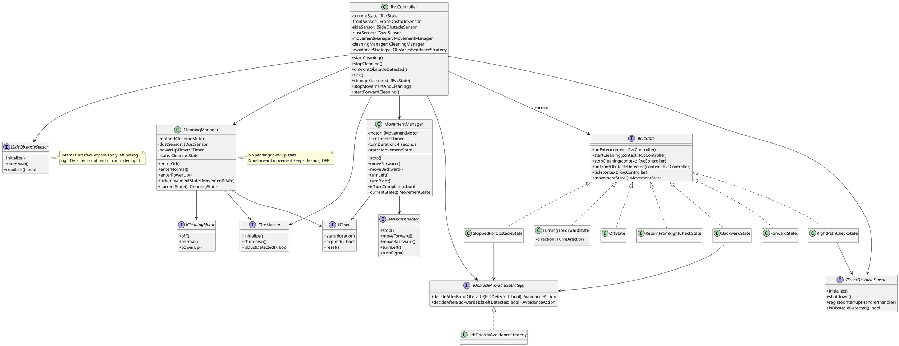
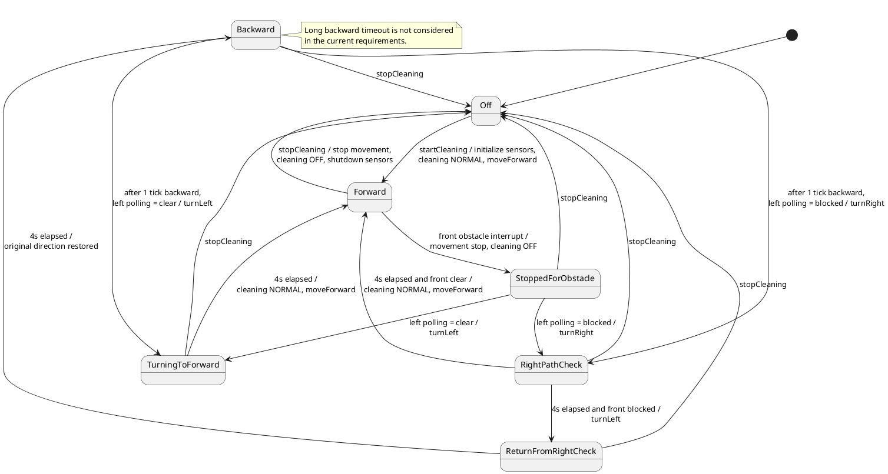
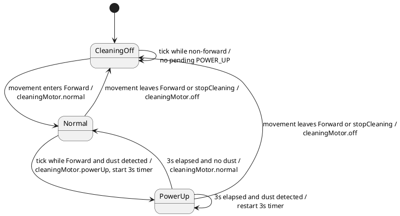
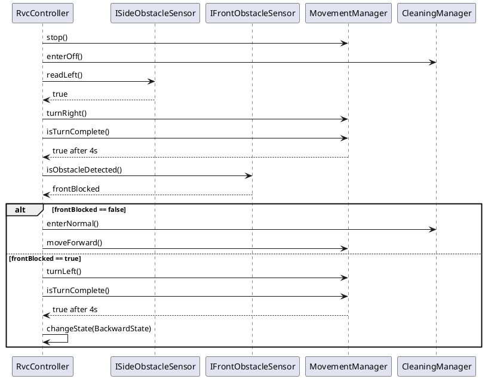
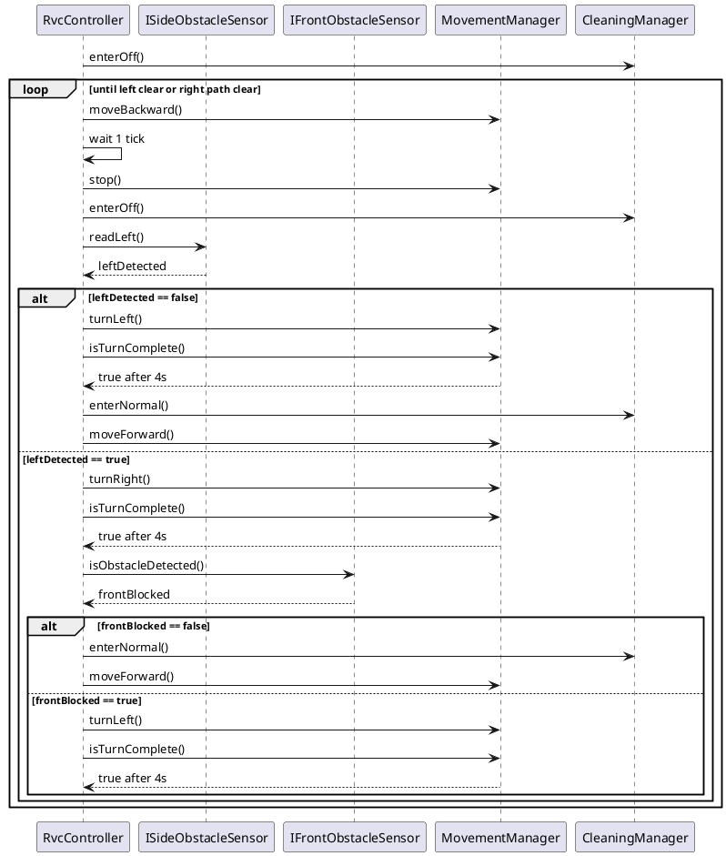
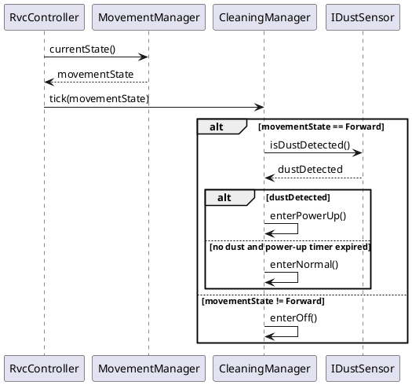

# RVC Controller Design Specification

## 1. 현재 단계

현재 단계는 Design (Refactoring & Update)이다. 본 문서는 승인된 Requirements 및 Analysis 산출물을 바탕으로 legacy `rvc-controller` 설계를 수정한다.

본 단계에서는 코드 구현을 수행하지 않는다. 구현은 본 설계 산출물 승인 이후 Implementation 단계에서 진행한다.

## 2. 설계 범위와 바운더리

설계 대상은 `rvc-controller` 내부 구조이다. 사용자, 전방 센서 하드웨어, 측면 센서 하드웨어, 먼지 센서 하드웨어, Movement Motor, Cleaning Motor는 기존과 동일하게 외부 actor로 유지한다.

| 항목 | 설계 결정 |
|---|---|
| 시스템 바운더리 | legacy와 동일하게 `rvc-controller` 내부만 설계 대상으로 둔다. |
| simulator | 기존 simulator 및 검증 인프라는 수정하지 않는다. simulator의 우측 장애물 정보는 검증 관찰 데이터로만 사용할 수 있다. |
| 우측 센서 | controller 내부 판단 입력과 내부 인터페이스에서 제거한다. |
| 우측 경로 확인 | `90도 우회전 완료 후 전방 센싱`으로 대체한다. |
| 청소 흡입 | movement가 정지/회전/후진 상태이면 cleaning motor는 OFF이다. 직진 시작 시 최소 상태는 NORMAL이다. |

## 3. Legacy 설계 유지 항목

| Legacy 요소 | 유지 여부 | 이유 |
|---|---|---|
| `RvcController` | 유지 | 사용자 입력, 센서 입력, 상태 전이, manager 조정을 담당하는 최상위 조정 객체 역할이 유효하다. |
| State 패턴 | 유지 | 이동 상태별 이벤트 처리와 전이를 분리하는 구조가 변경 요구사항에도 적합하다. |
| `MovementManager` | 유지 | movement motor 명령과 회전 완료 시간 관리를 분리하는 책임이 유효하다. |
| `CleaningManager` | 유지하되 수정 | cleaning motor 상태와 POWER_UP 타이머 관리는 유지하되, 비전진 중 NORMAL/pending 동작은 제거한다. |
| Sensor/Motor 인터페이스 | 유지하되 수정 | 외부 하드웨어 추상화 경계는 유지하되, 우측 센서 입력은 내부 인터페이스에서 제거한다. |
| `ITimer` | 유지 | 4초 회전 완료와 3초 POWER_UP 유지 시간을 테스트 가능하게 한다. |

## 4. Design Modification Rationale

| ID | 수정 대상 | 수정 이유 | 설계 방향 |
|---|---|---|---|
| DD-001 | 측면 센서 인터페이스 | 실제 우측 센서가 제거되어 `rightDetected`를 controller 판단 입력으로 사용할 수 없다. | `ISideObstacleSensor`는 좌측 polling만 제공한다. |
| DD-002 | 장애물 회피 상태 흐름 | legacy의 `front+left+right` 직접 감지가 불가능하다. | `RightPathCheckState`를 추가하여 우회전 후 전방 센싱으로 우측 경로를 확인한다. |
| DD-003 | 삼방향 장애물 처리 | 삼방향 조건은 우측 센서가 아니라 우측 경로 확인 실패로 판단되어야 한다. | 우측 경로가 막히면 원래 방향 복귀 후 `BackwardState` 루프에 진입한다. |
| DD-004 | 후진 루프 | 180도 회전 대체가 불가능하며 1 tick 후진이 필요하다. | `BackwardState`는 1 tick 후진 후 매번 좌측 polling을 수행한다. |
| DD-005 | 청소 흡입 상태 | 움직이지 않을 때 cleaning이 켜져 있으면 안 된다. | movement stop/turn/backward 시 cleaning OFF, forward 시작 시 NORMAL을 보장한다. |
| DD-006 | 먼지 감지 | 먼지 센서는 이벤트가 아니라 1 tick polling 입력이다. | `CleaningManager::tick(movementState)`에서 전진 중 dust polling을 수행한다. |
| DD-007 | POWER_UP pending | 비전진 중 먼지 값을 나중에 POWER_UP 조건으로 저장하지 않는다. | `pendingPowerUp` 개념과 API를 제거한다. |
| DD-008 | 회전 시간 | 요구사항에서 회전 완료 시간이 4초로 변경되었다. | `MovementManager` 기본 회전 시간은 4초로 변경한다. |

## 5. Refactoring Targets

| 영역 | Legacy 설계 | Revised 설계 |
|---|---|---|
| `SideObstacleSnapshot` | `leftDetected`, `rightDetected` 포함 | 제거하거나 `LeftObstacleSnapshot { leftDetected }`로 축소한다. controller 내부에는 `rightDetected` 필드가 남지 않는다. |
| `ISideObstacleSensor` | 좌우 장애물 값을 polling | 좌측 장애물 값만 polling한다. 예: `readLeft()` 또는 `read()` returning `LeftObstacleSnapshot`. |
| `IObstacleSensor` compatibility | legacy simulator 입력에 `isRightDetected()` 존재 | controller 판단 흐름에서는 사용하지 않는다. 필요 시 adapter 내부 검증 관찰값으로만 격리한다. |
| `IObstacleAvoidanceStrategy` | 좌우 snapshot으로 좌회전/우회전/후진 결정 | 좌측 값만으로 `TurnLeft` 또는 `CheckRightPath`를 결정한다. 우측 경로 결과는 state machine이 처리한다. |
| `StoppedForObstacleState` | 좌우 snapshot을 읽고 즉시 방향 결정 | 좌측 polling 후 좌측이 비어 있으면 좌회전, 막혀 있으면 `RightPathCheckState`로 전이한다. |
| `TurningState` | 좌/우 회전 완료 후 항상 전진 | 일반 회전 완료 후에만 전진한다. 우측 경로 확인용 우회전은 별도 상태가 전방 센싱 결과를 판단한다. |
| `BackwardState` | 후진 중 좌우 snapshot으로 해제 방향 결정 | 1 tick 후진 후 좌측 polling을 수행한다. 좌측이 비면 좌회전, 계속 막히면 우측 경로 확인으로 전이한다. |
| `CleaningManager` | 비전진 중 NORMAL 유지 및 pending POWER_UP 지원 | 비전진 중 OFF 유지, pending 제거, 전진 tick에서 dust polling으로 POWER_UP 판단. |

## 6. Updated Interface Definitions

### 6.1 Sensor Interfaces

```cpp
class IFrontObstacleSensor {
public:
    virtual void initialize() = 0;
    virtual void shutdown() = 0;
    virtual void registerInterruptHandler(std::function<void()> handler) = 0;

    // Used after RightPathCheckState finishes a 90-degree right turn.
    virtual bool isObstacleDetected() = 0;
};

class ISideObstacleSensor {
public:
    virtual void initialize() = 0;
    virtual void shutdown() = 0;

    // Left-side polling only. No right sensor value is exposed internally.
    virtual bool readLeft() = 0;
};

class IDustSensor {
public:
    virtual void initialize() = 0;
    virtual void shutdown() = 0;

    // Polled once per controller tick while movement state is Forward.
    virtual bool isDustDetected() = 0;
};
```

### 6.2 Movement and Cleaning Interfaces

```cpp
class IMovementMotor {
public:
    virtual void stop() = 0;
    virtual void moveForward() = 0;
    virtual void moveBackward() = 0;
    virtual void turnLeft() = 0;
    virtual void turnRight() = 0;
};

class ICleaningMotor {
public:
    virtual void off() = 0;
    virtual void normal() = 0;
    virtual void powerUp() = 0;
};
```

### 6.3 Manager Interfaces

```cpp
class MovementManager {
public:
    void stop();
    void moveForward();
    void moveBackward();
    void turnLeft();
    void turnRight();
    bool isTurnComplete() const;
    MovementState currentState() const;
};

class CleaningManager {
public:
    void enterOff();
    void enterNormal();
    void enterPowerUp();

    // Performs dust polling only when movementState == MovementState::Forward.
    void tick(MovementState movementState);
    CleaningState currentState() const;
};
```

`CleaningManager`는 `pendingPowerUp()` 및 비전진 중 먼지 저장 API를 제공하지 않는다.

### 6.4 Obstacle Avoidance Strategy

```cpp
enum class AvoidanceAction {
    TurnLeft,
    CheckRightPath
};

class IObstacleAvoidanceStrategy {
public:
    virtual AvoidanceAction decideAfterFrontObstacle(bool leftDetected) const = 0;
    virtual AvoidanceAction decideAfterBackwardTick(bool leftDetected) const = 0;
};
```

| 메서드 | 결정 규칙 |
|---|---|
| `decideAfterFrontObstacle(false)` | 전방 단독 장애물로 보고 좌회전을 선택한다. |
| `decideAfterFrontObstacle(true)` | 전방+좌측 장애물로 보고 우측 경로 확인을 선택한다. |
| `decideAfterBackwardTick(false)` | 후진 후 좌측이 열렸으므로 좌회전을 선택한다. |
| `decideAfterBackwardTick(true)` | 좌측이 계속 막혀 있으므로 우측 경로 확인을 선택한다. |

## 7. Revised Class Diagram



## 8. Revised Movement State Machine

### 8.1 Movement States

| 상태 | 의미 |
|---|---|
| `Off` | 청소 세션이 시작되지 않았거나 종료된 상태 |
| `Forward` | 전진 청소 상태. cleaning motor는 최소 NORMAL이다. |
| `StoppedForObstacle` | 전방 장애물 interrupt 후 movement와 cleaning이 모두 멈춘 상태 |
| `TurningToForward` | 좌회전 후 전진하기 위한 일반 회전 상태 |
| `RightPathCheck` | 우측 경로 확인을 위해 90도 우회전하고, 완료 후 전방 센싱을 수행하는 상태 |
| `ReturnFromRightCheck` | 우측 경로가 막혀 있을 때 90도 좌회전으로 원래 방향에 복귀하는 상태 |
| `Backward` | 원래 방향으로 복귀한 상태에서 1 tick 후진하고 좌측 polling을 수행하는 상태 |

### 8.2 Movement State Diagram



### 8.3 RightPathCheck 상세 규칙

| 단계 | 동작 |
|---|---|
| 1 | `RightPathCheckState::onEnter()`에서 cleaning OFF를 유지하고 movement motor에 90도 우회전 명령을 보낸다. |
| 2 | `MovementManager::isTurnComplete()`가 4초 경과를 반환할 때까지 tick을 기다린다. |
| 3 | 회전 완료 후 `IFrontObstacleSensor::isObstacleDetected()`로 전방 값을 polling한다. |
| 4 | 전방 장애물이 없으면 현재 우회전한 방향으로 전진한다. 이때 cleaning motor에 NORMAL을 먼저 보장한다. |
| 5 | 전방 장애물이 있으면 `ReturnFromRightCheckState`로 전이하고 90도 좌회전으로 원래 방향에 복귀한다. |
| 6 | 원래 방향 복귀 후 `BackwardState`에서 1 tick 후진한다. |

## 9. Revised Cleaning State Machine



| 규칙 | 설명 |
|---|---|
| Cleaning invariant | movement가 `Forward`가 아니면 cleaning state는 `CleaningOff`이다. |
| Forward minimum | movement가 `Forward`로 진입할 때 cleaning state는 최소 `Normal`이다. |
| Dust polling | `Forward` tick에서 먼지 센서를 polling한다. |
| Pending 제거 | 정지/회전/후진 중 먼지 값은 이후 POWER_UP 조건으로 저장하지 않는다. |

## 10. Key Interaction Design

### 10.1 전방+좌측 장애물 후 우측 경로 확인



### 10.2 삼방향 장애물 반복 처리



### 10.3 Dust Polling



## 11. Dependency Analysis

| 의존성 | 설계 판단 |
|---|---|
| `RvcController` -> sensors/managers/strategy | 기존 조정자 역할이므로 유지한다. |
| state classes -> `RvcController` context | 기존 State 패턴의 context 접근 구조를 유지한다. |
| `MovementManager` -> `CleaningManager` | 직접 의존시키지 않는다. movement와 cleaning 결합 규칙은 `RvcController` 또는 state transition helper에서 조정한다. |
| `CleaningManager` -> `MovementManager` | 직접 의존시키지 않고 `tick(MovementState)`로 필요한 상태만 전달한다. |
| sensors -> controller | 전방 interrupt callback 외에는 controller를 직접 참조하지 않는다. |
| simulator adapter -> controller | controller 내부 인터페이스에는 좌측 값만 전달한다. 우측 관찰값은 controller 판단으로 전달하지 않는다. |

이 구조는 manager 간 순환 의존을 만들지 않는다.

## 12. Requirements to Design Traceability

| 요구사항/분석 규칙 | 설계 요소 |
|---|---|
| RVC-FR-035, DR-010 | `ISideObstacleSensor::readLeft()`, `rightDetected` 제거 |
| RVC-FR-009, RVC-FR-036, RVC-FR-037, DR-011 | `RightPathCheckState`, `IFrontObstacleSensor::isObstacleDetected()` |
| RVC-FR-011, DR-012 | `ReturnFromRightCheckState`, `BackwardState` |
| RVC-FR-013, RVC-CON-009, DR-013 | `BackwardState`의 1 tick 후진 및 매회 좌측 polling |
| RVC-FR-015, RVC-CON-003, DR-005 | `MovementManager` 4초 회전 타이머 |
| RVC-FR-038, DR-015 | `RvcController::stopMovementAndCleaning()`, cleaning OFF invariant |
| RVC-FR-024, DR-016 | `RvcController::startForwardCleaning()`, `CleaningManager::enterNormal()` |
| RVC-FR-039, RVC-CON-011, DR-017 | `CleaningManager::tick(MovementState)`의 dust polling |
| RVC-FR-018, RVC-FR-019, DR-018 | `pendingPowerUp` 제거 |
| RVC-CON-007, Analysis Boundary Confirmation | simulator 우측 값은 검증 관찰 데이터로만 유지 |

## 13. Implementation Guidance for Next Stage

Implementation 단계에서는 다음 순서로 수정하는 것이 안전하다.

1. `Types.hpp`에서 우측 센서 snapshot과 회전 시간 상수를 정리한다.
2. `Interfaces.hpp`에서 내부 측면 센서 인터페이스를 좌측 polling으로 축소한다.
3. `CleaningManager`에서 pending POWER_UP을 제거하고 `tick(MovementState)` 설계로 변경한다.
4. `MovementManager`의 기본 회전 시간을 4초로 변경한다.
5. `RvcStates`에 `RightPathCheckState`, `ReturnFromRightCheckState`, revised `BackwardState` 흐름을 반영한다.
6. `LeftPriorityAvoidanceStrategy`를 좌측 기반 결정으로 축소한다.
7. 기존 regression test를 갱신하고, 우측 경로 확인 및 cleaning OFF invariant 테스트를 추가한다.

## 14. Design Verification Checklist

| 체크 항목 | 결과 |
|---|---|
| Analysis 단계에서 확정한 system boundary를 유지하는가? | 예 |
| legacy architecture를 불필요하게 재작성하지 않는가? | 예 |
| 내부 인터페이스에서 right sensor 의존을 제거했는가? | 예 |
| 우측 경로 확인이 명시적인 state transition으로 표현되었는가? | 예 |
| movement stop 시 cleaning OFF, forward 시작 시 NORMAL 규칙이 반영되었는가? | 예 |
| dust sensor가 polling 방식으로 반영되었는가? | 예 |
| 구현 가능한 class/interface 수준으로 구체화되었는가? | 예 |
