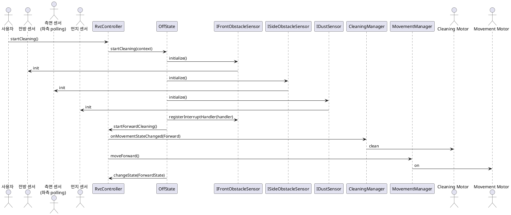
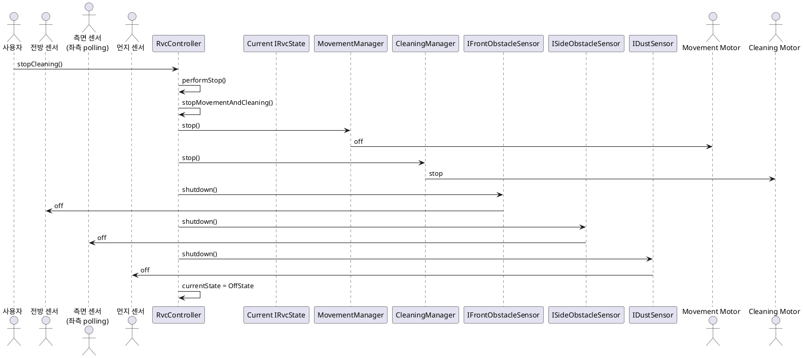
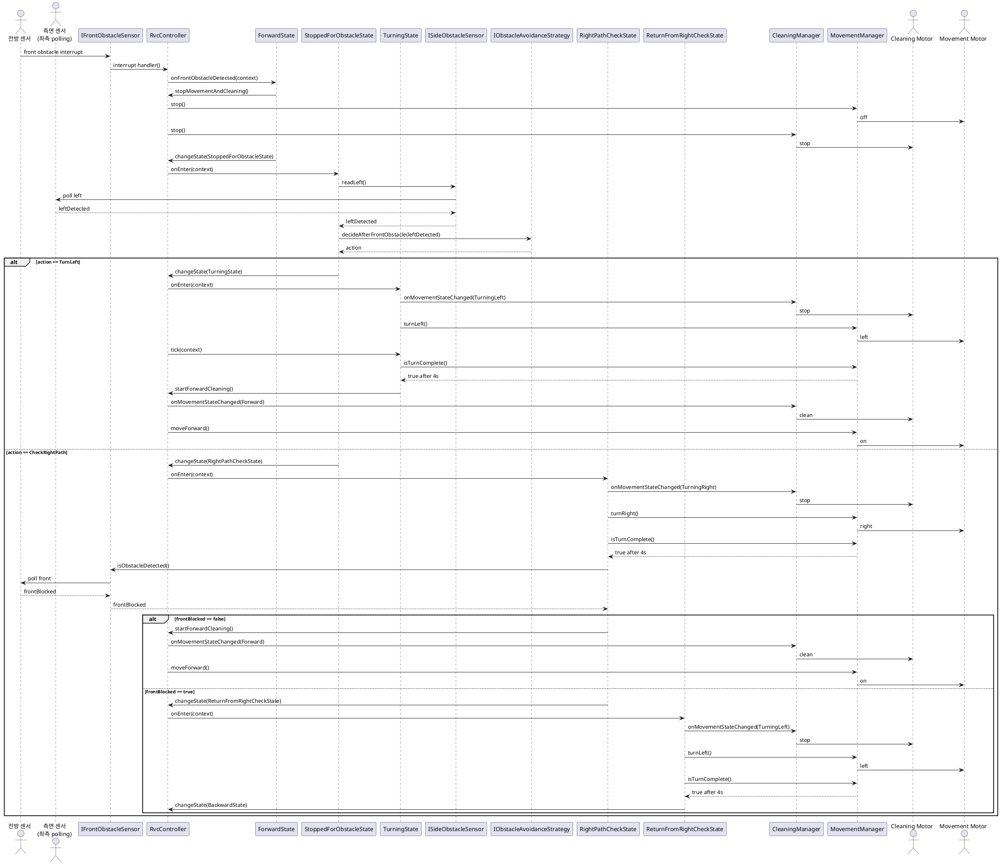
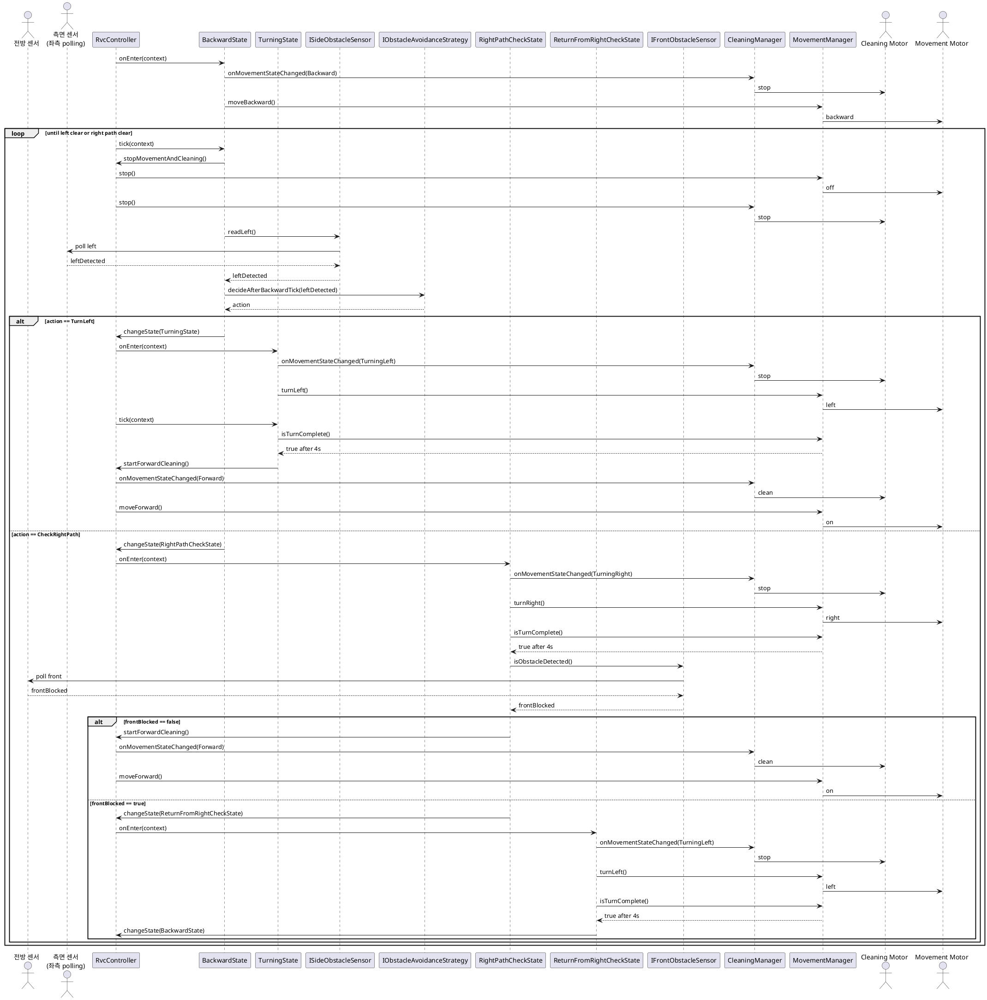
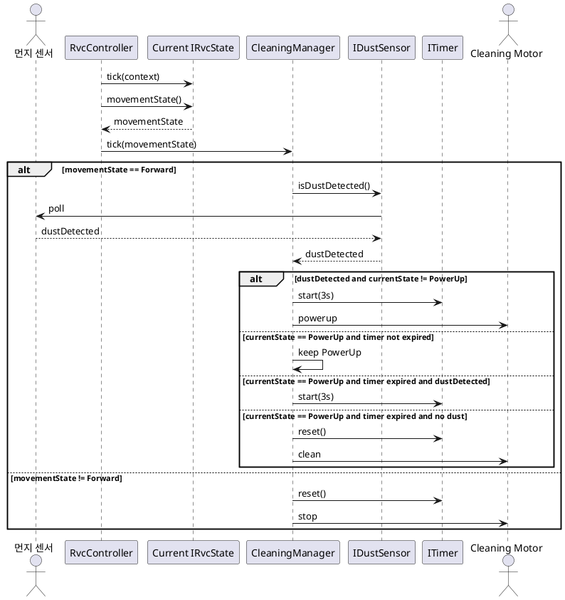

# RVC Design Sequence Diagrams

## SD-001 자동 진공 청소 시작

```plantuml
@startuml
actor "사용자" as User
actor "전방 센서" as FrontHw
actor "측면 센서\n(좌측 polling)" as SideHw
actor "먼지 센서" as DustHw
participant "RvcController" as RVC
participant "OffState" as Off
participant "IFrontObstacleSensor" as Front
participant "ISideObstacleSensor" as Side
participant "IDustSensor" as Dust
participant "CleaningManager" as CleanMgr
participant "MovementManager" as MoveMgr
actor "Cleaning Motor" as CleanHw
actor "Movement Motor" as MoveHw

User -> RVC : startCleaning()
RVC -> Off : startCleaning(context)
Off -> Front : initialize()
Front -> FrontHw : init
Off -> Side : initialize()
Side -> SideHw : init
Off -> Dust : initialize()
Dust -> DustHw : init
Off -> Front : registerInterruptHandler(handler)
Off -> RVC : startForwardCleaning()
RVC -> CleanMgr : onMovementStateChanged(Forward)
CleanMgr -> CleanHw : clean
RVC -> MoveMgr : moveForward()
MoveMgr -> MoveHw : on
Off -> RVC : changeState(ForwardState)
@enduml
```

## SD-002 자동 진공 청소 종료

```plantuml
@startuml
actor "사용자" as User
actor "전방 센서" as FrontHw
actor "측면 센서\n(좌측 polling)" as SideHw
actor "먼지 센서" as DustHw
participant "RvcController" as RVC
participant "Current IRvcState" as State
participant "MovementManager" as MoveMgr
participant "CleaningManager" as CleanMgr
participant "IFrontObstacleSensor" as Front
participant "ISideObstacleSensor" as Side
participant "IDustSensor" as Dust
actor "Movement Motor" as MoveHw
actor "Cleaning Motor" as CleanHw

User -> RVC : stopCleaning()
RVC -> RVC : performStop()
RVC -> RVC : stopMovementAndCleaning()
RVC -> MoveMgr : stop()
MoveMgr -> MoveHw : off
RVC -> CleanMgr : stop()
CleanMgr -> CleanHw : stop
RVC -> Front : shutdown()
Front -> FrontHw : off
RVC -> Side : shutdown()
Side -> SideHw : off
RVC -> Dust : shutdown()
Dust -> DustHw : off
RVC -> RVC : currentState = OffState
@enduml
```

## SD-003 전방 장애물 회피

```plantuml
@startuml
actor "전방 센서" as FrontHw
actor "측면 센서\n(좌측 polling)" as SideHw
participant "IFrontObstacleSensor" as Front
participant "RvcController" as RVC
participant "ForwardState" as Forward
participant "StoppedForObstacleState" as Stopped
participant "TurningState" as Turning
participant "ISideObstacleSensor" as Side
participant "IObstacleAvoidanceStrategy" as Strategy
participant "RightPathCheckState" as RightCheck
participant "ReturnFromRightCheckState" as Return
participant "CleaningManager" as CleanMgr
participant "MovementManager" as MoveMgr
actor "Cleaning Motor" as CleanHw
actor "Movement Motor" as MoveHw

FrontHw -> Front : front obstacle interrupt
Front -> RVC : interrupt handler()
RVC -> Forward : onFrontObstacleDetected(context)
Forward -> RVC : stopMovementAndCleaning()
RVC -> MoveMgr : stop()
MoveMgr -> MoveHw : off
RVC -> CleanMgr : stop()
CleanMgr -> CleanHw : stop
Forward -> RVC : changeState(StoppedForObstacleState)

RVC -> Stopped : onEnter(context)
Stopped -> Side : readLeft()
Side -> SideHw : poll left
SideHw --> Side : leftDetected
Side --> Stopped : leftDetected
Stopped -> Strategy : decideAfterFrontObstacle(leftDetected)
Strategy --> Stopped : action

alt action == TurnLeft
    Stopped -> RVC : changeState(TurningState)
    RVC -> Turning : onEnter(context)
    Turning -> CleanMgr : onMovementStateChanged(TurningLeft)
    CleanMgr -> CleanHw : stop
    Turning -> MoveMgr : turnLeft()
    MoveMgr -> MoveHw : left
    RVC -> Turning : tick(context)
    Turning -> MoveMgr : isTurnComplete()
    MoveMgr --> Turning : true after 4s
    Turning -> RVC : startForwardCleaning()
    RVC -> CleanMgr : onMovementStateChanged(Forward)
    CleanMgr -> CleanHw : clean
    RVC -> MoveMgr : moveForward()
    MoveMgr -> MoveHw : on
else action == CheckRightPath
    Stopped -> RVC : changeState(RightPathCheckState)
    RVC -> RightCheck : onEnter(context)
    RightCheck -> CleanMgr : onMovementStateChanged(TurningRight)
    CleanMgr -> CleanHw : stop
    RightCheck -> MoveMgr : turnRight()
    MoveMgr -> MoveHw : right
    RightCheck -> MoveMgr : isTurnComplete()
    MoveMgr --> RightCheck : true after 4s
    RightCheck -> Front : isObstacleDetected()
    Front -> FrontHw : poll front
    FrontHw --> Front : frontBlocked
    Front --> RightCheck : frontBlocked
    alt frontBlocked == false
        RightCheck -> RVC : startForwardCleaning()
        RVC -> CleanMgr : onMovementStateChanged(Forward)
        CleanMgr -> CleanHw : clean
        RVC -> MoveMgr : moveForward()
        MoveMgr -> MoveHw : on
    else frontBlocked == true
        RightCheck -> RVC : changeState(ReturnFromRightCheckState)
        RVC -> Return : onEnter(context)
        Return -> CleanMgr : onMovementStateChanged(TurningLeft)
        CleanMgr -> CleanHw : stop
        Return -> MoveMgr : turnLeft()
        MoveMgr -> MoveHw : left
        Return -> MoveMgr : isTurnComplete()
        MoveMgr --> Return : true after 4s
        Return -> RVC : changeState(BackwardState)
    end
end
@enduml
```

## SD-004 삼방향 장애물 처리

```plantuml
@startuml
actor "전방 센서" as FrontHw
actor "측면 센서\n(좌측 polling)" as SideHw
participant "RvcController" as RVC
participant "BackwardState" as Backward
participant "TurningState" as Turning
participant "ISideObstacleSensor" as Side
participant "IObstacleAvoidanceStrategy" as Strategy
participant "RightPathCheckState" as RightCheck
participant "ReturnFromRightCheckState" as Return
participant "IFrontObstacleSensor" as Front
participant "CleaningManager" as CleanMgr
participant "MovementManager" as MoveMgr
actor "Cleaning Motor" as CleanHw
actor "Movement Motor" as MoveHw

RVC -> Backward : onEnter(context)
Backward -> CleanMgr : onMovementStateChanged(Backward)
CleanMgr -> CleanHw : stop
Backward -> MoveMgr : moveBackward()
MoveMgr -> MoveHw : backward

loop until left clear or right path clear
    RVC -> Backward : tick(context)
    Backward -> RVC : stopMovementAndCleaning()
    RVC -> MoveMgr : stop()
    MoveMgr -> MoveHw : off
    RVC -> CleanMgr : stop()
    CleanMgr -> CleanHw : stop
    Backward -> Side : readLeft()
    Side -> SideHw : poll left
    SideHw --> Side : leftDetected
    Side --> Backward : leftDetected
    Backward -> Strategy : decideAfterBackwardTick(leftDetected)
    Strategy --> Backward : action

    alt action == TurnLeft
        Backward -> RVC : changeState(TurningState)
        RVC -> Turning : onEnter(context)
        Turning -> CleanMgr : onMovementStateChanged(TurningLeft)
        CleanMgr -> CleanHw : stop
        Turning -> MoveMgr : turnLeft()
        MoveMgr -> MoveHw : left
        RVC -> Turning : tick(context)
        Turning -> MoveMgr : isTurnComplete()
        MoveMgr --> Turning : true after 4s
        Turning -> RVC : startForwardCleaning()
        RVC -> CleanMgr : onMovementStateChanged(Forward)
        CleanMgr -> CleanHw : clean
        RVC -> MoveMgr : moveForward()
        MoveMgr -> MoveHw : on
    else action == CheckRightPath
        Backward -> RVC : changeState(RightPathCheckState)
        RVC -> RightCheck : onEnter(context)
        RightCheck -> CleanMgr : onMovementStateChanged(TurningRight)
        CleanMgr -> CleanHw : stop
        RightCheck -> MoveMgr : turnRight()
        MoveMgr -> MoveHw : right
        RightCheck -> MoveMgr : isTurnComplete()
        MoveMgr --> RightCheck : true after 4s
        RightCheck -> Front : isObstacleDetected()
        Front -> FrontHw : poll front
        FrontHw --> Front : frontBlocked
        Front --> RightCheck : frontBlocked
        alt frontBlocked == false
            RightCheck -> RVC : startForwardCleaning()
            RVC -> CleanMgr : onMovementStateChanged(Forward)
            CleanMgr -> CleanHw : clean
            RVC -> MoveMgr : moveForward()
            MoveMgr -> MoveHw : on
        else frontBlocked == true
            RightCheck -> RVC : changeState(ReturnFromRightCheckState)
            RVC -> Return : onEnter(context)
            Return -> CleanMgr : onMovementStateChanged(TurningLeft)
            CleanMgr -> CleanHw : stop
            Return -> MoveMgr : turnLeft()
            MoveMgr -> MoveHw : left
            Return -> MoveMgr : isTurnComplete()
            MoveMgr --> Return : true after 4s
            Return -> RVC : changeState(BackwardState)
        end
    end
end
@enduml
```

## SD-005 먼지 감지에 따른 흡입 강화

```plantuml
@startuml
actor "먼지 센서" as DustHw
participant "RvcController" as RVC
participant "Current IRvcState" as State
participant "CleaningManager" as CleanMgr
participant "IDustSensor" as Dust
participant "ITimer" as Timer
actor "Cleaning Motor" as CleanHw

RVC -> State : tick(context)
RVC -> State : movementState()
State --> RVC : movementState
RVC -> CleanMgr : tick(movementState)

alt movementState == Forward
    CleanMgr -> Dust : isDustDetected()
    Dust -> DustHw : poll
    DustHw --> Dust : dustDetected
    Dust --> CleanMgr : dustDetected
    alt dustDetected and currentState != PowerUp
        CleanMgr -> Timer : start(3s)
        CleanMgr -> CleanHw : powerup
    else currentState == PowerUp and timer not expired
        CleanMgr -> CleanMgr : keep PowerUp
    else currentState == PowerUp and timer expired and dustDetected
        CleanMgr -> Timer : start(3s)
    else currentState == PowerUp and timer expired and no dust
        CleanMgr -> Timer : reset()
        CleanMgr -> CleanHw : clean
    end
else movementState != Forward
    CleanMgr -> Timer : reset()
    CleanMgr -> CleanHw : stop
end
@enduml
```
