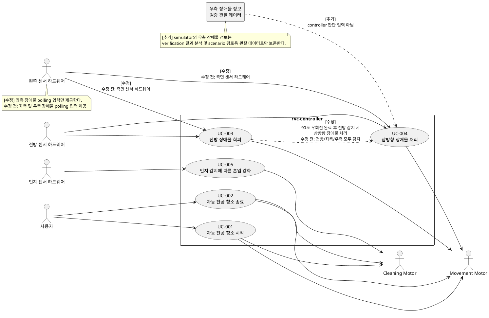

# RVC Use Case Diagram

## 현재 단계

현재 단계는 Requirements (Revision)이다. 본 문서는 `rvc-controller`의 자동 진공 청소 제어 로직 유스케이스 다이어그램 변경을 정의한다.

```plantuml
@startuml
left to right direction

actor "사용자" as User
actor "전방 센서 하드웨어" as FrontSensor
actor "왼쪽 센서 하드웨어" as LeftSensor
actor "먼지 센서 하드웨어" as DustSensor
actor "Movement Motor" as MoveMotor
actor "Cleaning Motor" as CleanMotor
rectangle "우측 장애물 정보\n검증 관찰 데이터" as RightObservation

rectangle "rvc-controller" {
  usecase "UC-001\n자동 진공 청소 시작" as UC1
  usecase "UC-002\n자동 진공 청소 종료" as UC2
  usecase "UC-003\n전방 장애물 회피" as UC3
  usecase "UC-004\n삼방향 장애물 처리" as UC4
  usecase "UC-005\n먼지 감지에 따른 흡입 강화" as UC5
}

User --> UC1
User --> UC2
FrontSensor --> UC3
LeftSensor --> UC3 : [수정]\n수정 전: 측면 센서 하드웨어
FrontSensor --> UC4
LeftSensor --> UC4 : [수정]\n수정 전: 측면 센서 하드웨어
DustSensor --> UC5

UC1 --> MoveMotor
UC1 --> CleanMotor
UC2 --> MoveMotor
UC2 --> CleanMotor
UC3 --> MoveMotor
UC4 --> MoveMotor
UC5 --> CleanMotor

RightObservation ..> UC4 : [추가]\ncontroller 판단 입력 아님
UC3 ..> UC4 : [수정]\n90도 우회전 완료 후 전방 감지 시\n삼방향 장애물 처리\n수정 전: 전방/좌측/우측 모두 감지

note bottom of LeftSensor
[수정] 좌측 장애물 polling 입력만 제공한다.
수정 전: 좌측 및 우측 장애물 polling 입력 제공
end note

note bottom of RightObservation
[추가] simulator의 우측 장애물 정보는
verification 결과 분석 및 scenario 검토용 관찰 데이터로만 보존한다.
end note

/' [수정] 수정 전: Mermaid flowchart LR 기반 유스케이스 다이어그램 '/
@enduml
```
